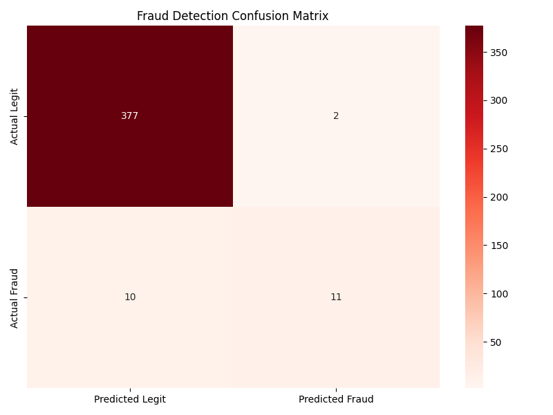

# 🕵️‍♂️ Credit Card Fraud Detection (Imbalanced Classification)

An end-to-end Machine Learning pipeline designed to identify fraudulent credit card transactions in a highly imbalanced, "messy" real-world dataset.

## 🚀 Project Overview
In real-world financial data, fraudulent transactions represent a very small fraction of total volume. This project demonstrates how to handle imbalanced datasets where standard "Accuracy" metrics fail.
1. **Data Engineering:** Programmatic generation of a synthetic, imbalanced dataset (95% Legit, 5% Fraud) with overlapping behavioral patterns to simulate real-world "sneaky" fraud.
2. **Model Training:** Implementing a `RandomForestClassifier` via Scikit-Learn.
3. **Evaluation:** Prioritizing a Confusion Matrix and the Precision-Recall tradeoff over raw accuracy.

## 📊 Model Performance (The Precision-Recall Tradeoff)

Despite a highly imbalanced dataset, the Random Forest model achieved the following on the Fraud class:
* **Precision:** `0.85` (When the model flags fraud, it is correct 85% of the time, minimizing false alarms for innocent customers).
* **Recall:** `0.52` (The model successfully caught 52% of all actual fraudulent transactions).
* **Accuracy:** `0.97` (Demonstrating why raw accuracy is a misleading metric for imbalanced data).

## 💻 How to Run Locally

1. **Clone the repository**
   ```bash
   git clone [https://github.com/yourusername/credit_card_fraud_detector.git](https://github.com/yourusername/credit_card_fraud_detector.git)
   cd credit_card_fraud_detector
